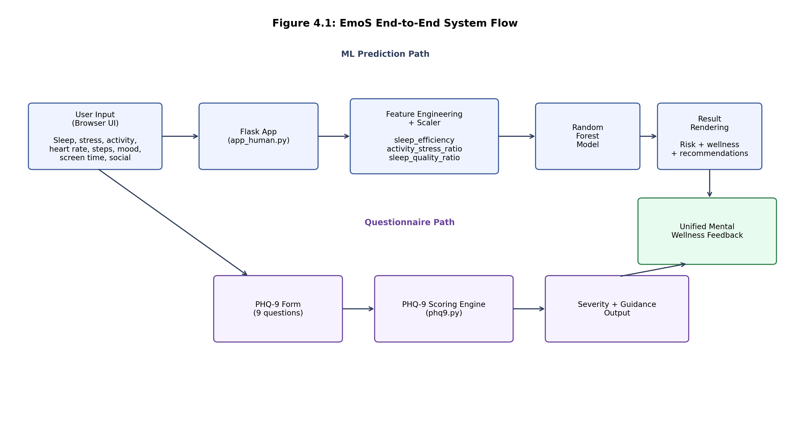
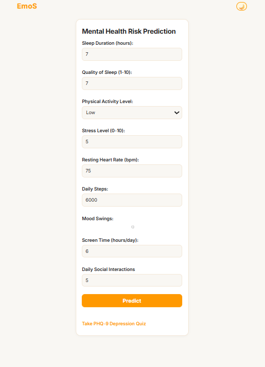
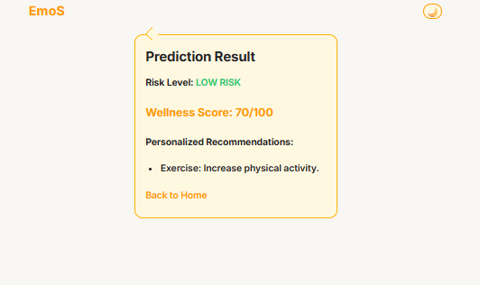
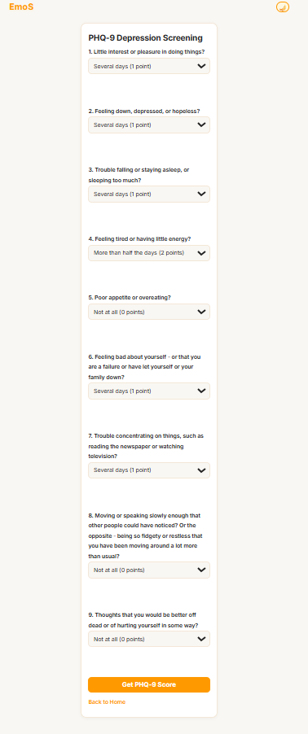
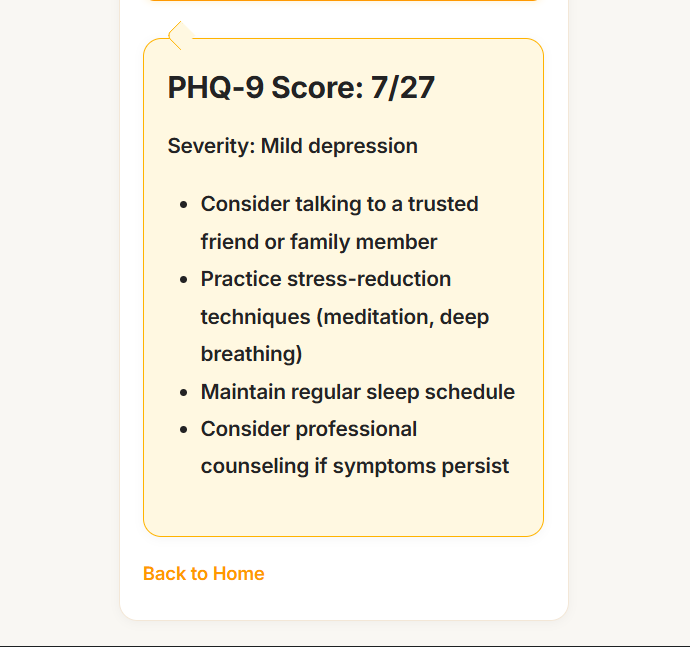

# EmoS

EmoS is a Flask-based mental wellness web app with two core flows:

- Mental health risk prediction from lifestyle inputs
- PHQ-9 depression screening with score-based guidance

The app combines a trained ML model (for risk classification) with rule-based wellness recommendations.

## What This Project Does

### 1) Mental health risk prediction
Users submit:
- sleep duration and sleep quality
- stress level
- activity level
- heart rate and daily steps
- screen time and social interaction
- mood swings

The backend engineers additional features, scales them, runs model inference, and returns:
- `HIGH RISK` or `LOW RISK`
- wellness score (`0-100`)
- personalized recommendations

### 2) PHQ-9 screening
The app includes a standard 9-question PHQ-9 form and returns:
- total score (`0-27`)
- severity band
- guidance text based on score range

## Tech Stack

- Python
- Flask
- scikit-learn
- NumPy
- Jinja2 templates (in `app_human.py` mode)

## Project Structure

- `app_human.py` - main Flask app using template files from `templates/`
- `app_flask.py` - alternative single-file version using inline HTML/CSS
- `phq9.py` - PHQ-9 questions, scoring, severity mapping, recommendations
- `templates/` - UI templates (`home`, `result`, `phq9`, `base`)
- `static/` - CSS and JS assets
- `requirements.txt` - Python dependencies
- `Sleep_health_and_lifestyle_dataset.csv` - dataset asset in repo

## Setup

### Prerequisites
- Python 3.8+
- `pip`

### Install
```bash
pip install -r requirements.txt
```

### Model file requirement
The app expects `mental_health_model.pkl` in the project root.

If this file is missing, startup fails with a file-not-found error. Place the trained model bundle in the root before running either app entrypoint.

## Run

Recommended (template-based version):

```bash
python app_human.py
```

Alternative (single-file inline UI version):

```bash
python app_flask.py
```

Then open: [http://localhost:5000](http://localhost:5000)

## Notes and Limitations

- This project is for educational/prototyping use.
- Outputs are not a clinical diagnosis.
- PHQ-9 results should not replace professional care.

If someone is in immediate danger or crisis, contact local emergency services or a crisis helpline right away.

## Troubleshooting

- **`FileNotFoundError: mental_health_model.pkl`**
  - Add `mental_health_model.pkl` to the project root.

- **Import/dependency errors**
  - Reinstall deps with `pip install -r requirements.txt`.
  - Use a clean virtual environment if versions conflict.

- **Port already in use**
  - Stop the process using port `5000`, or run Flask on a different port.

## Screenshots and Diagram

### 1) System Flow Diagram
This diagram shows the full end-to-end flow from browser input to ML inference, PHQ-9 scoring, and unified feedback output.


### 2) Home Prediction Form
This screen captures the lifestyle input form used for mental health risk prediction.


### 3) Prediction Result (Low Risk)
This screen shows the model prediction output with wellness score and personalized recommendation.


### 4) PHQ-9 Form (Completed Inputs)
This screen shows the PHQ-9 questionnaire after responses are selected and before score submission.


### 5) PHQ-9 Result
This screen shows the computed PHQ-9 score, severity level, and guidance recommendations.

